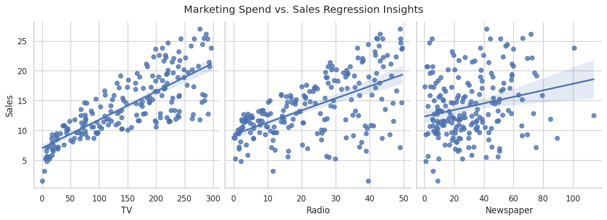

# Sales Prediction & Marketing Spend Optimization

[](https://nbviewer.org/github/DSEXPL0RER/codealpha_task_03/blob/main/sales-prediction-advertising.ipynb)

An end-to-end Python machine learning pipeline that models, analyzes, and predicts future revenue sales based on cross-platform advertising spend configurations. This project isolates high-performing channels and evaluates marketing return on investment (ROI) using data-driven statistics.

> 💡 **Notebook Not Rendering on GitHub?** Click the orange **Render NBViewer** badge above to view the fully interactive version of this project with all charts and outputs perfectly displayed!

---

## 📊 Project Overview & Core Findings
Using a dataset containing historical campaign expenditures across **TV, Radio, and Newspaper** platforms, we developed a Multiple Linear Regression model to identify exactly where capital is best utilized.

* **Model Strength ($R^2$):** **0.8994** (Our model accurately explains **89.9%** of all historical sales variations).
* **Prediction Error (RMSE):** **1.7816** (The pipeline predicts revenue outcomes within a narrow, reliable margin of error under 1.8 units).
* **Key Strategic Takeaway:** **Radio** provides the highest per-dollar conversion growth, while traditional print **Newspaper** spending delivers near-zero statistical impact on driving revenue sales.

---

## 📂 Repository Contents
* `Advertising.csv` — The foundational dataset containing platform-specific expenditures and sales figures.
* `sales-prediction-advertising.ipynb` — The complete Jupyter Notebook tracking data loading, cleaning, EDA, visualization, modeling, and evaluation steps.
* `sales_correlation_heatmap.png` — High-resolution visualization showing individual feature correlation matrices.
* `marketing_spend_regression_plots.png` — Line-of-best-fit visualization illustrating individual channel trajectories vs. Sales.

---

## 📈 Visual Data Insights

### 1. Variable Correlation Matrix
The heatmap below outlines the direct linear association between each advertising feature and final conversion rates.


* **TV ($0.782$):** Possesses the strongest overall linear anchor to revenue generation.
* **Radio ($0.576$):** Shows a healthy, moderate-to-strong connection with conversion spikes.
* **Newspaper ($0.228$):** Displays an insulated, weak association with target outcomes.

### 2. Regression Trajectory Plots
The visual analysis below charts continuous spending distributions alongside their statistical regression paths.



* **TV & Radio:** Showcase clear upward regression paths, confirming that continuous budget increments map directly to growing customer traction.
* **Newspaper:** Produces a scattered, flat slope, highlighting visual evidence of capital inefficiency.

---

## ⚙️ Model Formula & Impact Breakdown
The final linear modeling pipeline settled on the following mathematical formula to drive prediction estimates:

$$\text{Predicted Sales} = 2.9791 + (0.0447 \times \text{TV}) + (0.1892 \times \text{Radio}) + (0.0028 \times \text{Newspaper})$$

### Empirical Parameter Weights
* **Organic Baseline Sales ($2.9791$):** Expected conversion unit volume if all platform advertising budgets were temporarily halted.
* **Radio Coefficient ($0.1892$):** The top economic driver. Every standard dollar added translates into a **+0.1892** jump in sales.
* **TV Coefficient ($0.0447$):** A stable, moderate volume engine best used to protect overarching reach limits.
* **Newspaper Coefficient ($0.0028$):** Statistically irrelevant. Shows no real business case for continued funding.

---

## 🚀 Actionable Marketing Strategy
1. **Defund Traditional Print Media:** Terminate active assignments toward traditional **Newspaper** spaces. It does not scale sales revenue effectively.
2. **Aggressively Scale Audio Networks:** Reallocate print savings into **Radio, Podcasts, and Streaming Audio infrastructure** to exploit its high efficiency weight.
3. **Protect TV Budgets:** Maintain steady budget targets on **TV campaigns** to secure broad consumer discovery and fill the top of the sales funnel.

---

## 🛠️ Installation & Execution
To replicate the notebook execution pipeline locally, complete the following commands:

1. Clone the repository to your desktop machine:
```bash
git clone [https://github.com/DSEXPL0RER/codealpha_task_03.git](https://github.com/DSEXPL0RER/codealpha_task_03.git)
cd codealpha_task_03
